## ГБК Black Horse (2020)
Для ракеты Black Horse (гланый конструктор - Андрей Коробов, электронщик и разработчик ГБК - Виктор Киндеркнехт) был разработан ГБК бутербродного типа.
Основные параметры приведены в таблице

| Узел ГБК                 | Применяемые компоненты                                |
| ------------------------ | ----------------------------------------------------- |
| Компоновка               | Бутербродная                                          |
| Микроконтроллер          | STM32F411 (BlakPill)                                  |
| Среда программирования   | Arduino IDE                                           |
| Частота тактовая, МГц    | 100                                                   |
| Питание схемы, В         | 3.7                                                   |
| Количество линий питания | 2 (3.3В - цифровая часть, 5В - силовая часть + радио) |
| Гироскоп-акселерометр    | MPU9250, I2C + LSM6DS3, I2C                           |
| Барометр-термометр       | BMP280, I2C                                           |
| Прочие датчики           | Магнитометр внутри MPU9250, 2 газоанализатора         |

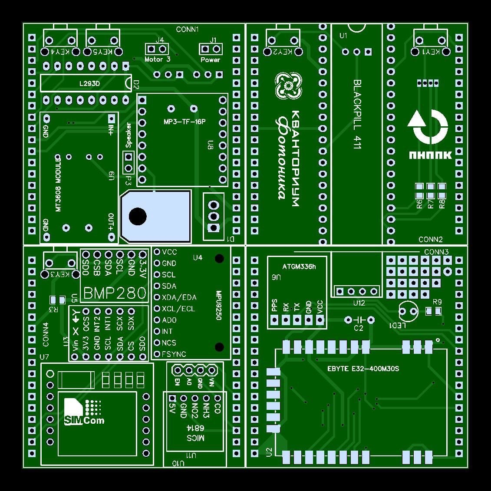

## Barsotion GBK GammaAnomalain (2024)
ГБК для ракеты 3ККИ24ПУМ1 Килька.

| Название параметра    | Параметр                                                         |
| --------------------- | ---------------------------------------------------------------- |
| Компоновка            | Одноплатная продольная                                           |
| Микроконтроллер       | LGT8F328P                                                        |
| Ядро                  | LGTX8 (8-бит AVR)                                                |
| Тактовая частота, МГц | 32 (16)                                                          |
| Гироскоп-акселерометр | MPU6050 (внешний модуль, подключается через разъем)              |
| Барометр-термометр    | 2x BMP388 (внешние модули, подключаются через разъем)            |
| Накопитель данных     | ПЗУ W25Q64, интерфейс - Single SPI, информационная емкость - 8МБ |
| Питание схемы, В      | 3.7                                                              |
| Линия питания 1       | 3.3В 500мА, для логических частей схемы                          |
| Линия питания 2       | 5-6В 3А, для сервоприводов                                       |
ГБК GammaAnomalain впервые содержал импульсный преобразователь напряжения распаянным на плате. Использовалась микросхема XL6019.
В качестве линейного регулятор 3.3В использовалась изначально микросхема 78L33. Однако оказалось, что падение напряжения на ней составляет порядка 1В, что слишком много, из-за чего питания микроконтроллеру не хватало.

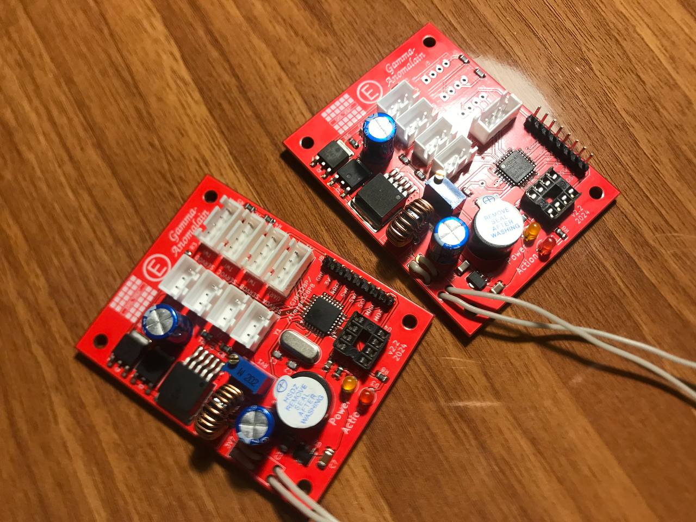

## Barsotion GBK DeltaAnomalain (2024)
ГБК для ракеты 3ККИ24ПУМ1 Килька.

| Название параметра    | Параметр                                                         |
| --------------------- | ---------------------------------------------------------------- |
| Компоновка            | Одноплатная продольная                                           |
| Микроконтроллер       | LGT8F328P                                                        |
| Ядро                  | LGTX8 (8-бит AVR)                                                |
| Тактовая частота, МГц | 32 (16)                                                          |
| Гироскоп-акселерометр | MPU6050 (распаян на плате)                                       |
| Барометр-термометр    | 2x BMP388 (внешние модули, подключаются через разъем)            |
| Накопитель данных     | ПЗУ W25Q64, интерфейс - Single SPI, информационная емкость - 8МБ |
| Питание схемы, В      | 3.7                                                              |
| Линия питания 1       | 3.3В 500мА, для логических частей схемы                          |
| Линия питания 2       | 5-6В 3А, для сервоприводов                                       |
|                       |                                                                  |

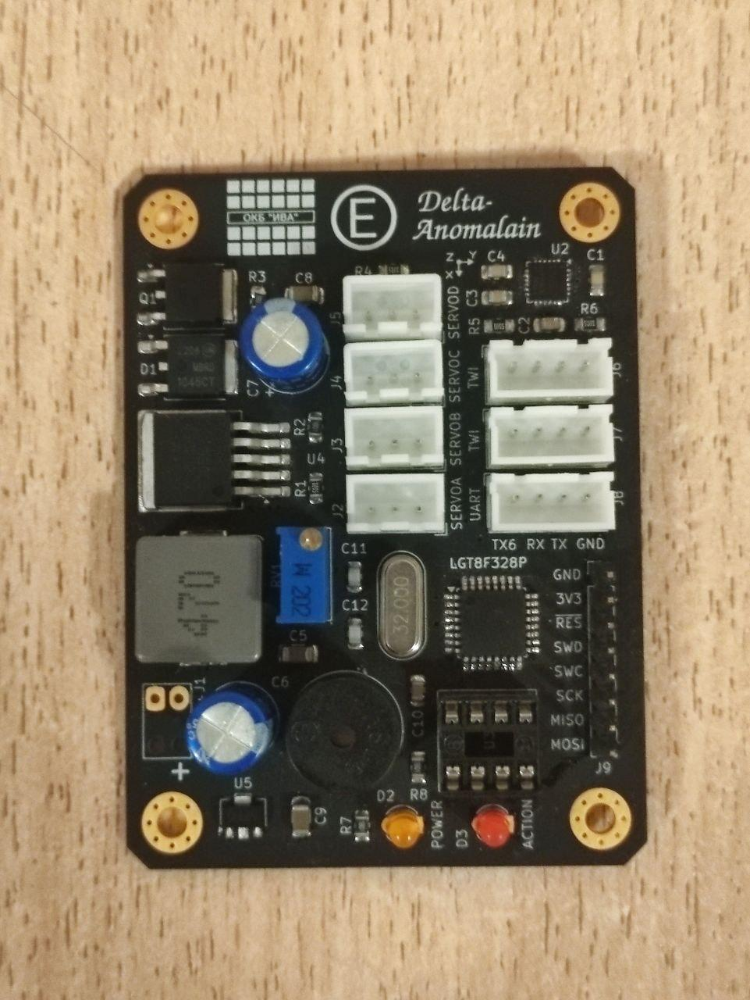
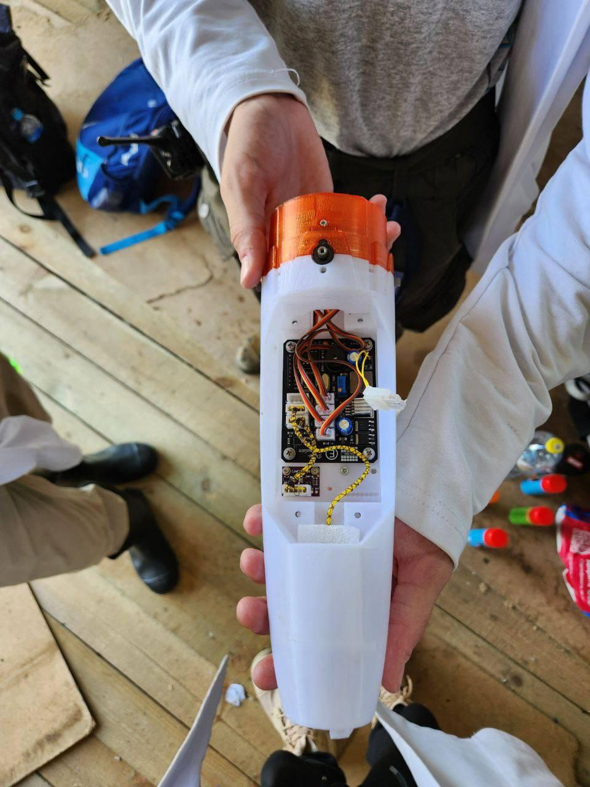
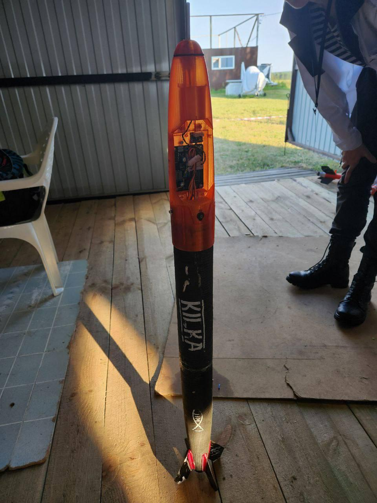
ГБК DeltaAnomalain создавался как дальнейшее развитие ГБК GammaAnomalain. Основное отличие в том, что гироскоп-акселерометр был распаян на плате, что позволило сократить массу ракеты, объем отсека электроники, а также повысить надежность. ГБК DeltaAnomalain был создан в 3 экземплярах. Экземпляр №3 оказался с нерабочим гироскопом-акселерометром. Экземпляр №1 был пущен на ракете "Килька-Small" 2 июля 2024 года. ГО ракеты был обнаружен спустя 46 часов после пуска, ГБК продолжал работу, батарея просела до 3.5В. Экземляр №2 был пущен на ракете "Килька-Big" 3 июля 2024, ГО совершил мягкую посадку в лесу Владимирской области, на текущий момент его судьба неизвестна.

## Barsotion DevBoard AH1
Разработанная сразу по приезду с кансата, это отладочная плата для гироскопа-акселерометра ICM-42688-P и барометра BMP388. Платы имеют сравнительно больше размеры. Изготовление и сборка проводились силами завода PCBasic.
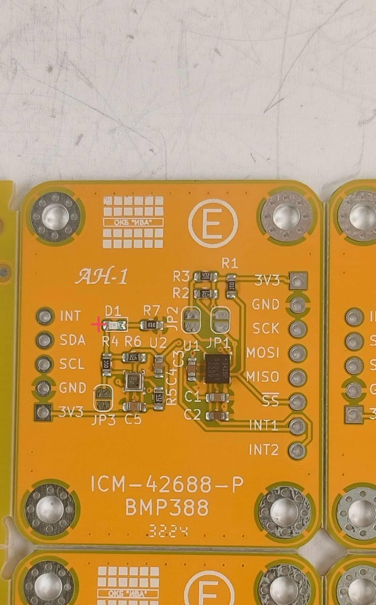
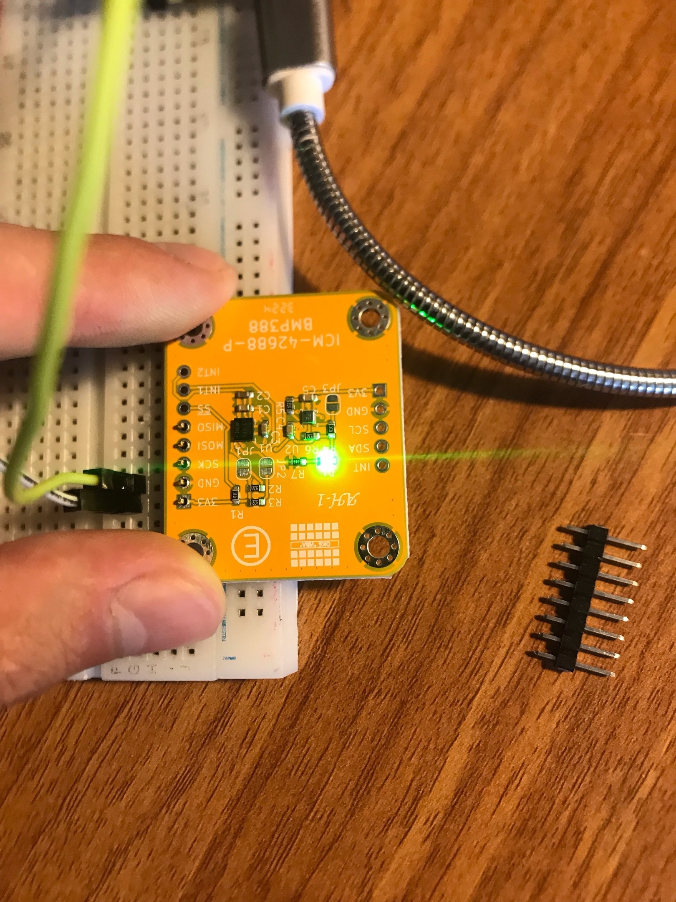

## Конструктор "Cansat-Russia"
Разработчик неизвестен, предположительно, Курск.
Проект ГБК регулярной лиги.

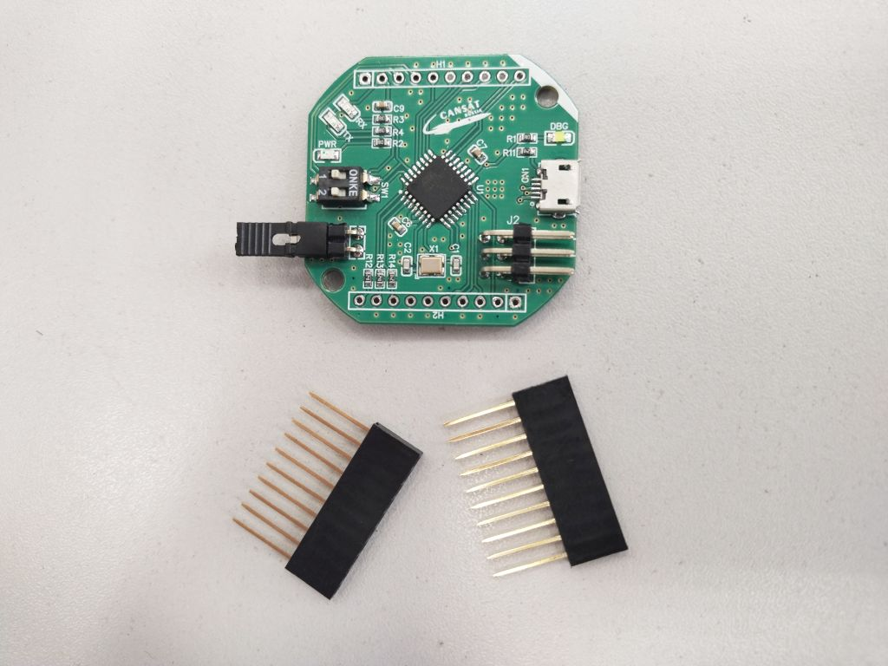
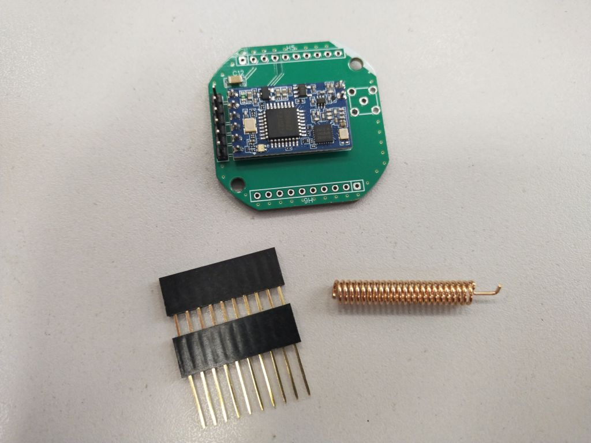
## Конструктор CEboard (СКБ Космический Градиент, 2021)
Проект ГБК регулярной лиги от СКБ Космический градиент.
Проект отличает хорошая проработанность, оригинальная трассировка, а также то, что на платах используются SMD-соеденители типа папа-мама с шагом 2мм, а не 2.54, как это обычно бывает, что позволяет сократить высоту ГБК и сэкономить место на самой плате. На плате питания вместо электролитических конденсаторов большой емкости используются керамические, что показывает, что разработчики знают и активно ориентируются на современную элементрую базу. Заслуживает внимания миниатюрный зуммер, установленный на плате питания. В проекте используются чип-резисторы и конденсаторы формата 0603, если бы использовались 0402, это позволило бы увеличить плотность компоновки и не допустить наличия компонентов на обратной стороне платы MCU. Для питания логической части схемы используется шина 3.3В, которые идут от импульсного преобразователя. Это не подойдет для более чувствительных датчиков. Датчики LSM6DS3 не являются хорошим выбором.

| Название параметра    | Параметр                                         |
| --------------------- | ------------------------------------------------ |
| Компоновка            | Бутербродная                                     |
| Микроконтроллер       | STM32F401RE                                      |
| Ядро                  | ARM Cortex-M4 (32-бит ARM)                       |
| Тактовая частота, МГц | 84                                               |
| Гироскоп-акселерометр | LSM6DS3, SPI                                     |
| Барометр-термометр    | BME280, SPI                                      |
| Магнитометр           | LIS3MDL, SPI                                     |
| Термометр             | DS18D20, 1-wire                                  |
| Накопитель данных     | SD-карта, интерфейс SDIO; EEPROM типа 24x64, I2C |
| Радио                 | nRF24l01, диапазон 2400МГц                       |
| GPS                   | ATGM336                                          |
| Питание схемы, В      | Предположительно 3.7В                            |
| Линия питания 1       | 3.3В, для логических частей схемы                |
| Линия питания 2       | 5В, радио ?                                      |
| Дополнительно         | ПЛИС Altera Cyclone V                            |

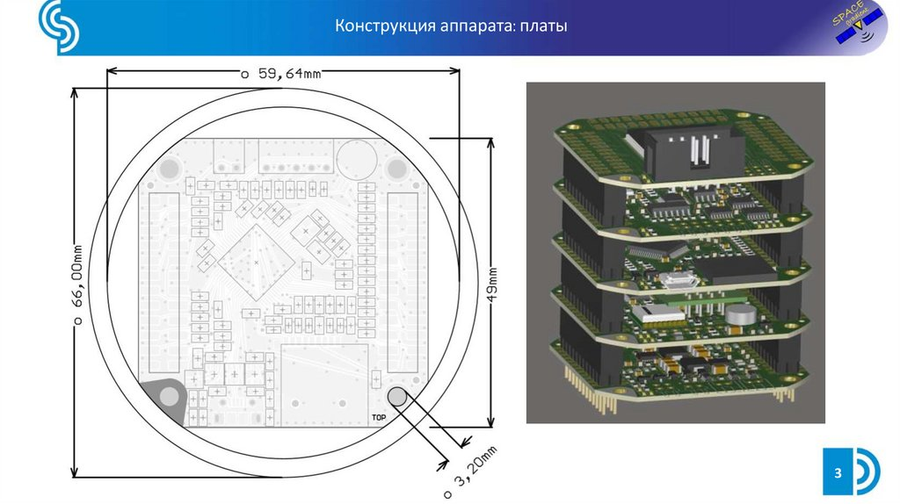
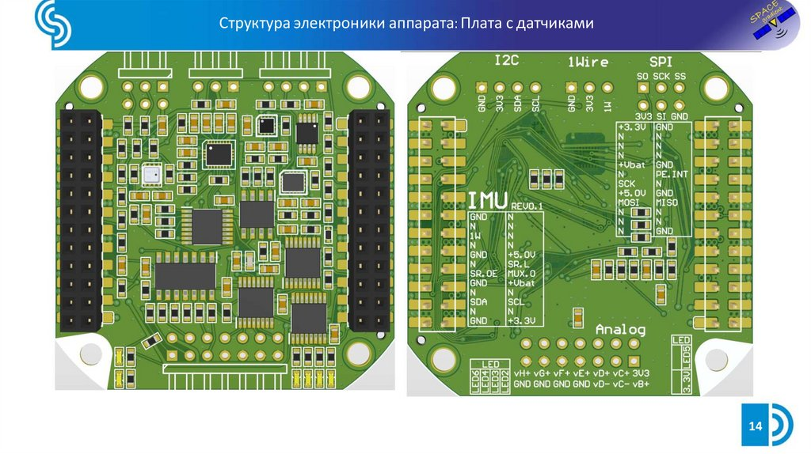
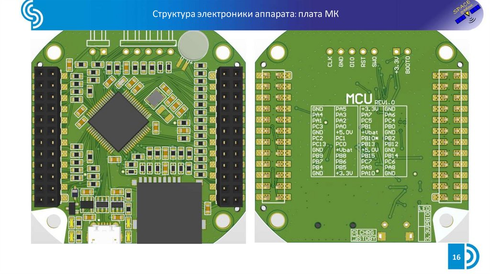
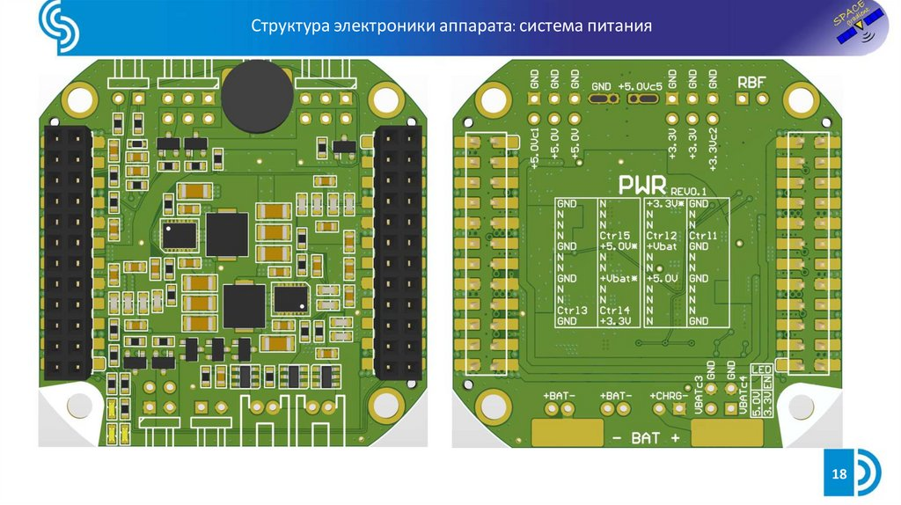
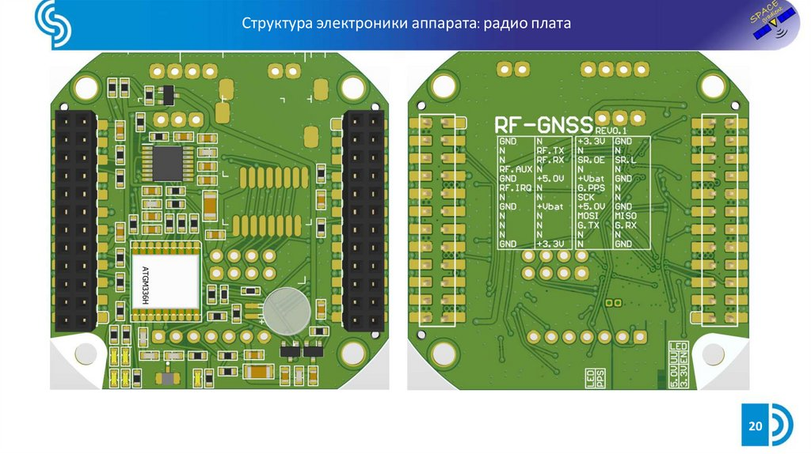
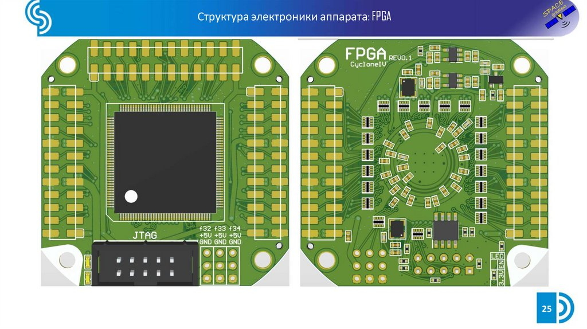
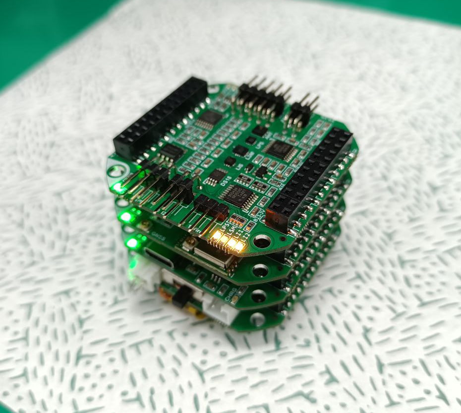

## Barsotion DevBoard AH2
Проект отладочной платы ESP32-S3 в формате ГБК
Задача проекта -- создать отладочную плату на базе ESP32-S3 с гироскопом и другими датчиками, дабы проверить возможные внутренние подставы и ловушки. Также необходимо измерить максимальную скорость обработки данных гироскопа-акселерометра

| Название параметра    | Параметр                                              |
| --------------------- | ----------------------------------------------------- |
| Компоновка            | Бутербродная                                          |
| Микроконтроллер       | ESP32-S3                                              |
| Ядро                  | 2* Xtensa LX7                                         |
| Тактовая частота, МГц | 240                                                   |
| Гироскоп-акселерометр | ICM-42688-P                                           |
| Барометр-термометр    | BMP388                                                |
| Гигрометр             | AHT20                                                 |
| Накопитель данных     | Разъем карты SD                                       |
| Напряжение питания, В | 3.7 (нестабилизированный) или 3.3 (стабилизированный) |
| Потребление схемы     | Расчеты не проводились                                |
