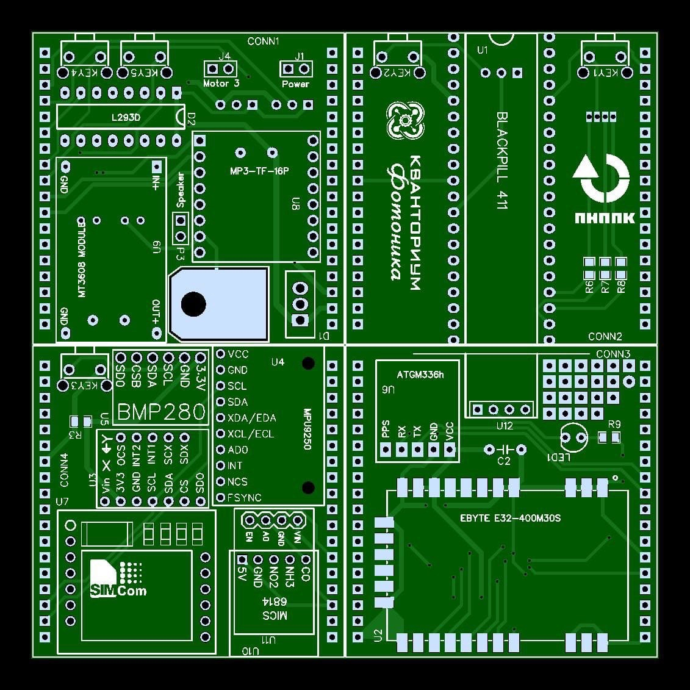
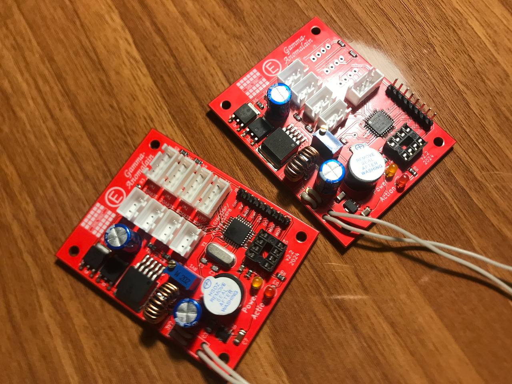
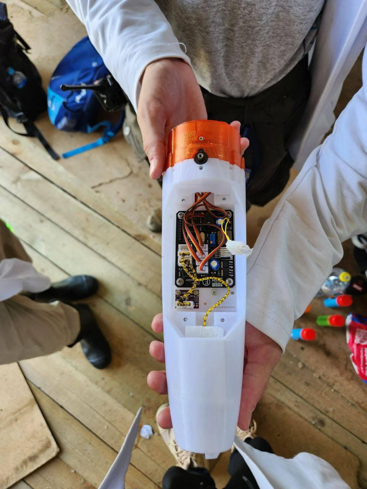
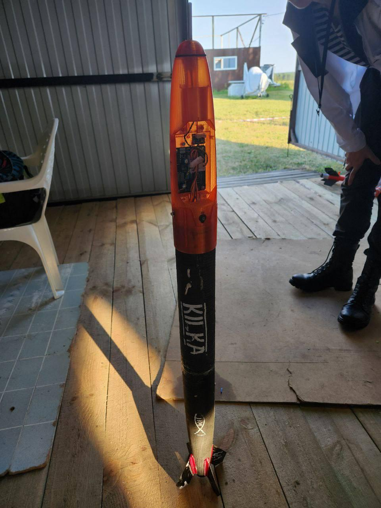

## ГБК Black Horse (2020)
Для ракеты Black Horse (гланый конструктор - Андрей Коробов, электронщик и разработчик ГБК - Виктор Киндеркнехт) был разработан ГБК бутербродного типа.
Основные параметры приведены в таблице

| Узел ГБК                 | Применяемые компоненты                                |
| ------------------------ | ----------------------------------------------------- |
| Компоновка               | Бутербродная                                          |
| Микроконтроллер          | STM32F411 (BlakPill)                                  |
| Среда программирования   | Arduino IDE                                           |
| Частота тактовая, МГц    | 100                                                   |
| Питание схемы, В         | 3.7                                                   |
| Количество линий питания | 2 (3.3В - цифровая часть, 5В - силовая часть + радио) |
| Гироскоп-акселерометр    | MPU9250, I2C + LSM6DS3, I2C                           |
| Барометр-термометр       | BMP280, I2C                                           |
| Прочие датчики           | Магнитометр внутри MPU9250, 2 газоанализатора         |

## Barsotion GBK GammaAnomalain (2024)
ГБК для ракеты 3ККИ24ПУМ1 Килька.

| Название параметра    | Параметр                                                         |
| --------------------- | ---------------------------------------------------------------- |
| Компоновка            | Одноплатная продольная                                           |
| Микроконтроллер       | LGT8F328P                                                        |
| Ядро                  | LGTX8 (8-бит AVR)                                                |
| Тактовая частота, МГц | 32 (16)                                                          |
| Гироскоп-акселерометр | MPU6050 (внешний модуль, подключается через разъем)              |
| Барометр-термометр    | 2x BMP388 (внешние модули, подключаются через разъем)            |
| Накопитель данных     | ПЗУ W25Q64, интерфейс - Single SPI, информационная емкость - 8МБ |
| Питание схемы, В      | 3.7                                                              |
| Линия питания 1       | 3.3В 500мА, для логических частей схемы                          |
| Линия питания 2       | 5-6В 3А, для сервоприводов                                       |
ГБК GammaAnomalain впервые содержал импульсный преобразователь напряжения распаянным на плате. Использовалась микросхема XL6019.
В качестве линейного регулятор 3.3В использовалась изначально микросхема 78L33. Однако оказалось, что падение напряжения на ней составляет порядка 1В, что слишком много, из-за чего питания микроконтроллеру не хватало.

## Barsotion GBK DeltaAnomalain (2024)
ГБК для ракеты 3ККИ24ПУМ1 Килька.

| Название параметра    | Параметр                                                         |
| --------------------- | ---------------------------------------------------------------- |
| Компоновка            | Одноплатная продольная                                           |
| Микроконтроллер       | LGT8F328P                                                        |
| Ядро                  | LGTX8 (8-бит AVR)                                                |
| Тактовая частота, МГц | 32 (16)                                                          |
| Гироскоп-акселерометр | MPU6050 (распаян на плате)                                       |
| Барометр-термометр    | 2x BMP388 (внешние модули, подключаются через разъем)            |
| Накопитель данных     | ПЗУ W25Q64, интерфейс - Single SPI, информационная емкость - 8МБ |
| Питание схемы, В      | 3.7                                                              |
| Линия питания 1       | 3.3В 500мА, для логических частей схемы                          |
| Линия питания 2       | 5-6В 3А, для сервоприводов                                       |
|                       |                                                                  |

ГБК DeltaAnomalain создавался как дальнейшее развитие ГБК GammaAnomalain. Основное отличие в том, что гироскоп-акселерометр был распаян на плате, что позволило сократить массу ракеты, объем отсека электроники, а также повысить надежность. ГБК DeltaAnomalain был создан в 3 экземплярах. Экземпляр №3 оказался с нерабочим гироскопом-акселерометром. Экземпляр №1 был пущен на ракете "Килька-Small" 2 июля 2024 года. ГО ракеты был обнаружен спустя 46 часов после пуска, ГБК продолжал работу, батарея просела до 3.5В. Экземляр №2 был пущен на ракете "Килька-Big" 3 июля 2024, ГО совершил мягкую посадку в лесу Владимирской области, на текущий момент его судьба неизвестна.
